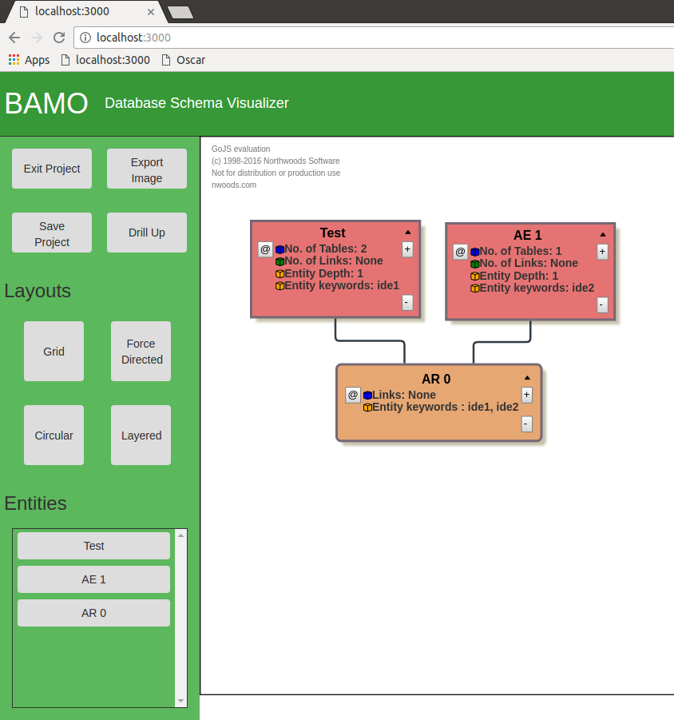
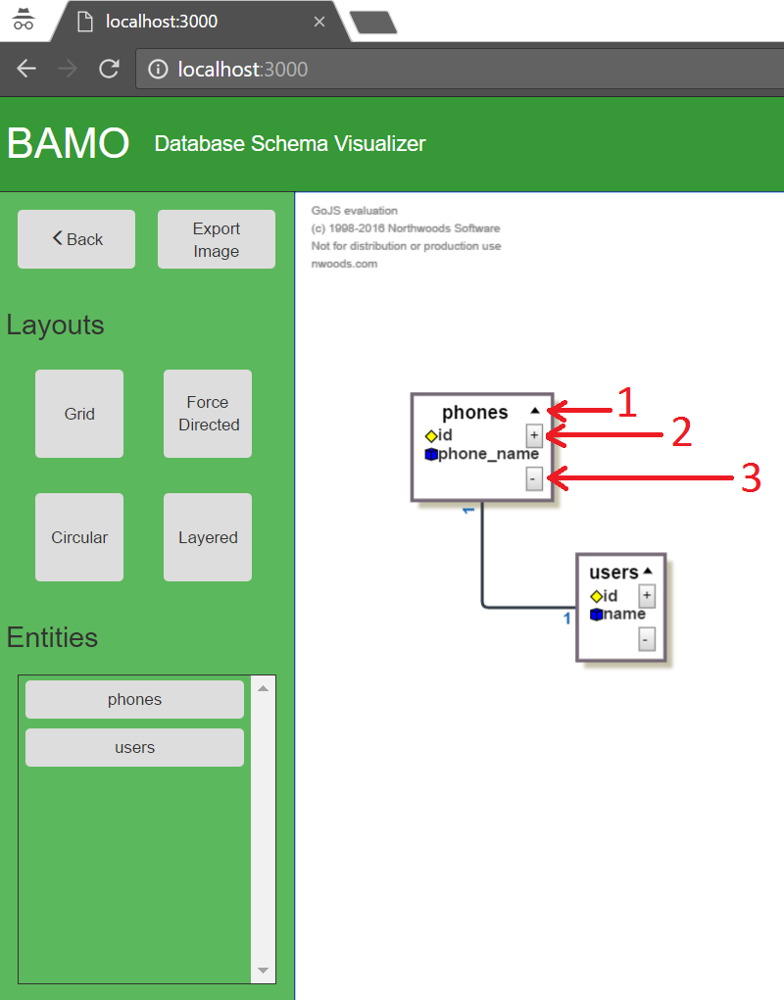

# DBVIS

DBVIS (Database Visualizer) is a web application that draws the table structure of a database along with the relationship that exist between
tables.

## Run
```
$ git checkout v2.0
$ npm install
$ cd serverjs
$ node server.js
```


## How to Use DBVIS

### Create a project
1. Click on the green button that reads "Create Project" located at the bottom left corner
2. Fill in the information in the forum.
  1. Project name
  2. IP address of the MySQL server. "localhost" if server is running on the same machine
  3. Port number. Usually MySQL servers run on port 3306.
  4. Database name. Name of the schema (database) that you wish to connect to.
  5. Username and password for MySQL server to authenticate yourself.
3. Click "Create project" located on the right at the bottom of the page.

Successful completion of project creation should return you to the main page where you can see the newly created project.


### Open a project
1. Select a project from the list
2. Click the button that reads "Open" at the bottom right corner

Successful completion of this section should bring you to the visualizer view where you can see a diagram of all entities - and their relationships - of the database (schema) and able to manipulate them for better visualisation purposes.


### Drill in and out

For any entity (Abstract entity or relation), click on the "@" button (because it looks like drilling) that is located at the top left corner of the entity.



- Red rectangles are "Abstract Entities", and
- Orange round-cornered rectangles are "Abstract Relations".


### Manipulate Diagram
This sections discusses some actions that you can perform on this view; after opening a project.



Figure 1 - Visualizer View

- Close the project by pressing the "Back" button
- Export an image by clicking the "Export Image" button. This will download a PNG file of what is visible in the diagram.
- Choose a layout by clicking on one of the four buttons in the "Layouts" section located in the left sidebar.
- Hide all attributes of an entity by clicking the "^" button indicated by "1" in figure 1.
- Hide an entity by clicking on the "-" button indicated by "3" in figure 1.
- Show related entities by clicking the "+" button indicated by "2" in figure 1.
- Toggle the view of an entity (I.e. show or hide an entity) by clicking the button with entity name from the "Entities" list located at the - bottom of the sidebar on the left.


### Persist layout and renames (Save Project)
To persist layout, cick on the "Save Project" button located in the sidebar; in the top left region. It is not necessary to save the project when drilling
in or out. It is sufficient to save the project before exiting to persist everything.
